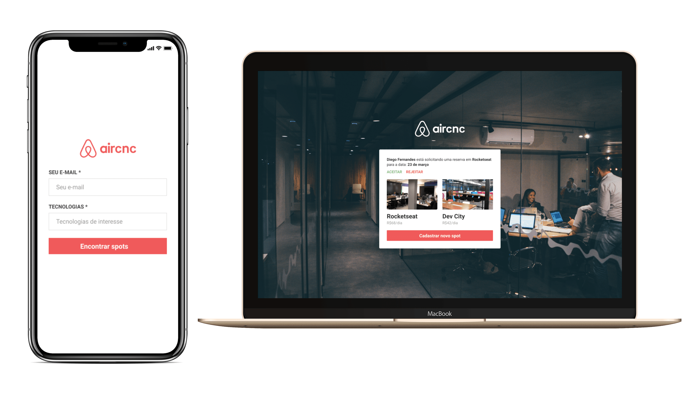
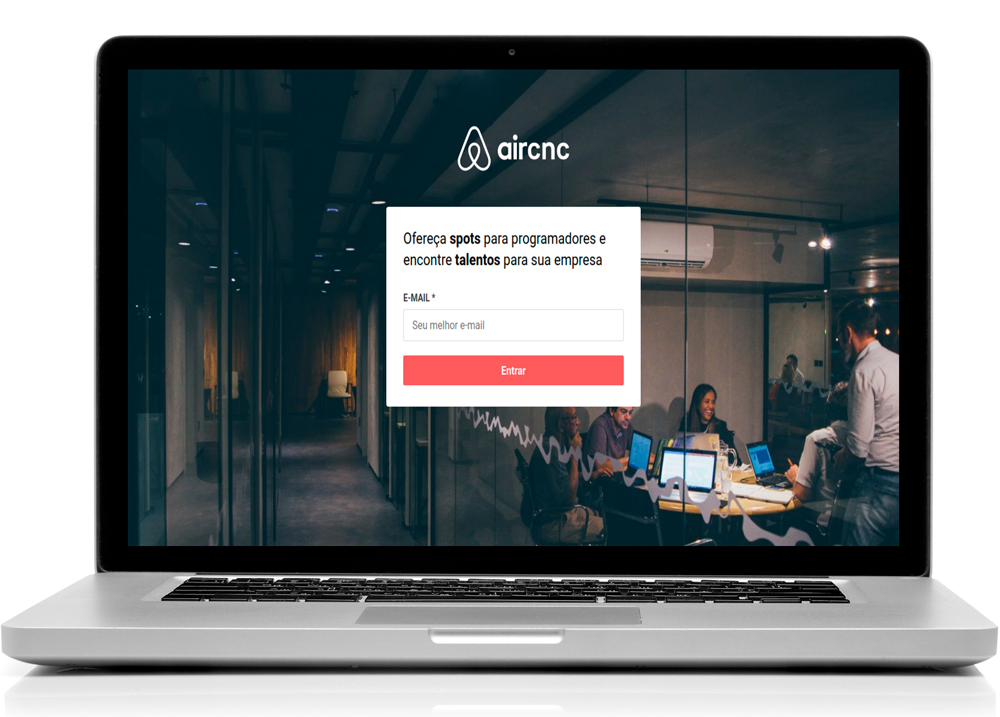
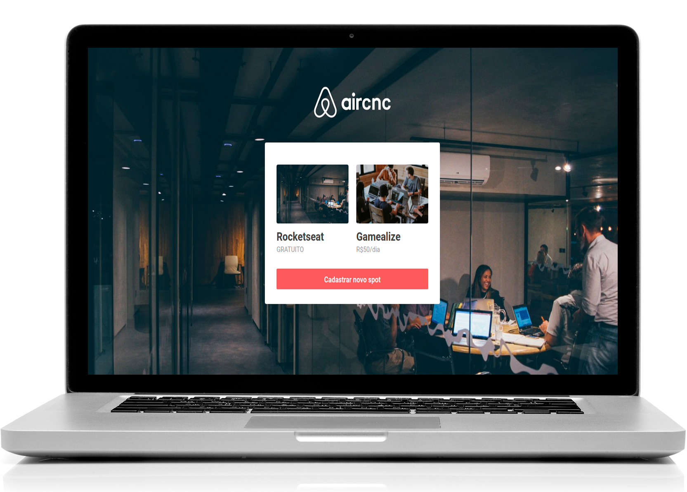
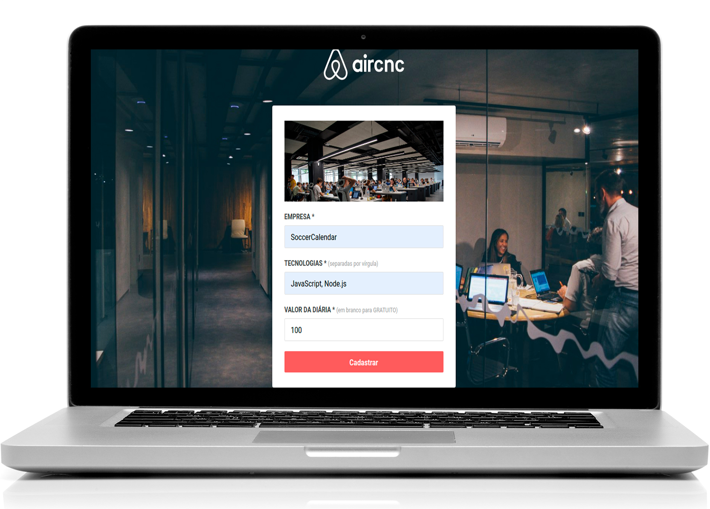
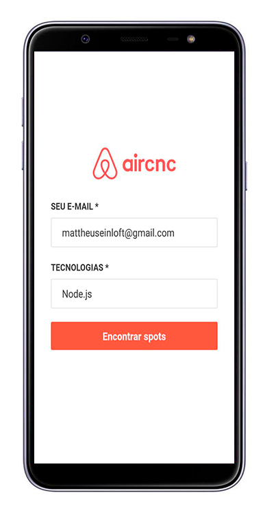
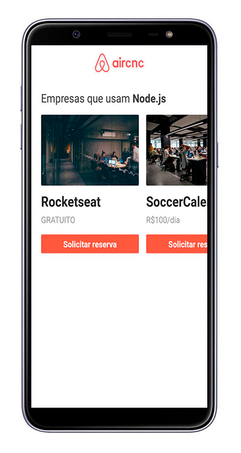
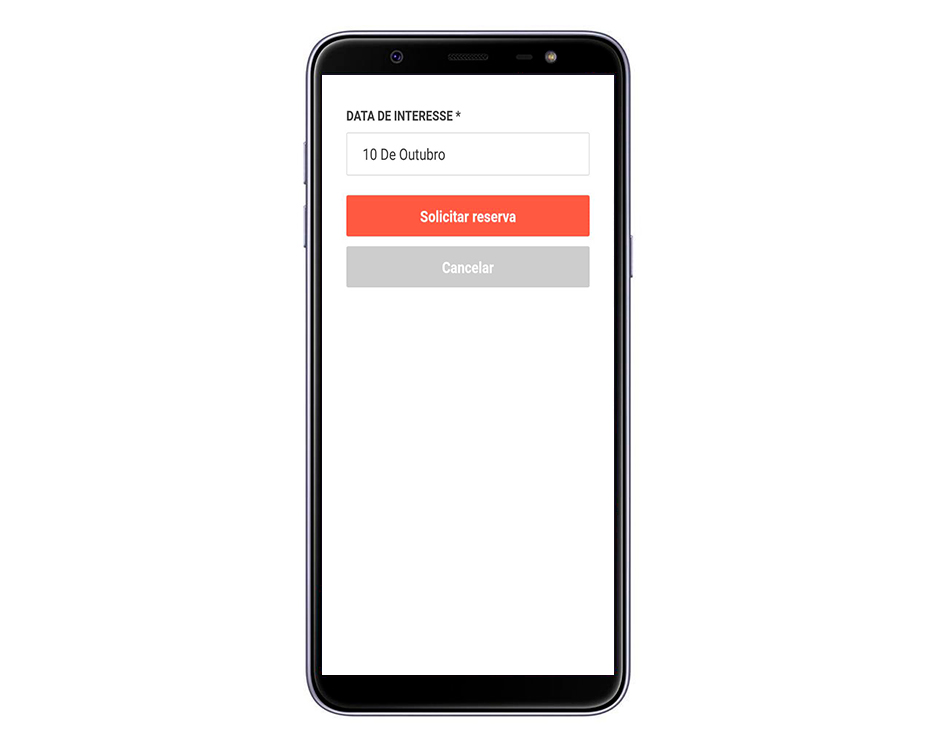

<h1 align="center">
    
</h1>

<h4 align="center">
  ☕ Code and coffee
</h4>

<p align="center">
  

  
  
  <a href="https://github.com/Rocketseat/semana-omnistack-9/commits/master">
    
  </a>

  
  
  <a href="https://www.linkedin.com/in/thiagoperes/">
    
  </a>
</p>

<p align="center">
  
</p>

## 💻 Projeto

Aircnc - é um projeto que visa conectar empresas que querem abrir spots e desenvolvedores que procuram um lugar para trocar ideias com devs, conhecer empresas e trabalhar lá por um período.

As empresas ou entidades poderão se cadastrar na plataforma web enviando:
- uma imagem do spot da empresa/entidade
- nome da empresa/entidade
- tecnologias disponíveis naquele spot
- e o valor da diária (podendo até ser gratuito) 

Os usuários terão acesso ao aplicativo móvel, onde poderão:
- navegar para ver as empresas/entidades cadastradas por tecnologia
- solicitar uma reserva do spot

Projeto desenvolvido durante a **Semana Omnistack** oferecida pela [Rocketseat](https://rocketseat.com.br).
A Semana Omnistack é uma experiência online com muito conteúdo prático, desafios e hacks onde o conteúdo fica disponível durante uma semana.

## 💻 Layout

O layout da aplicação está disponível no Figma:

<a href="https://www.figma.com/file/1SxgOMojOB2zYT0Mdk28lB/Ecoleta?node-id=136%3A546">
  
</a>

### Web

<p align="center" style="display: flex; align-items: flex-start; justify-content: center;">
  

  
  
  
</p>

<br>

### Mobile

<p align="center" style="display: flex; align-items: flex-start; justify-content: center;">
  

  
  
  
</p>

## 🚀 Tecnologias

Esse projeto foi desenvolvido com as seguintes tecnologias:

- [Expo](https://expo.io/)
- [Node.js](https://nodejs.org/en/)
- [ReactJS](https://reactjs.org)
- [React Native](https://facebook.github.io/react-native/)

## 🚀 Instalação e execução

Podemos considerar este projeto como sendo divido em três partes:
1. Back End (pasta backend) 
2. Front End (pasta frontend)
3. Mobile (pasta mobile)

💡 Tanto o Front-end quanto o Mobile precisam que o Back-end esteja sendo executado para funcionar.

### Pré-requisitos

Antes de começar, você vai precisar ter instalado em sua máquina as seguintes ferramentas:
1. [Git](https://git-scm.com)
2. [Node.js](https://nodejs.org/en/)
3. [VSCode](https://code.visualstudio.com/)

### 🎲 Rodando o servidor (Back End)

```bash
# Clone este repositório
$ git clone https://github.com/thiagoperesbr/omnistack9-aircnc.git
# Acesse a pasta do projeto no terminal/cmd
$ cd omnistack9-aircnc
# Vá para a pasta server
$ cd backend
# Instale as dependências
$ npm install
# Execute a aplicação em modo de desenvolvimento
$ npm run dev
# O servidor inciará na porta:3333 - acesse http://localhost:3333 
```

### 🧭 Rodando a aplicação web (Front End)

```bash
# Clone este repositório
$ git clone https://github.com/thiagoperesbr/omnistack9-aircnc.git
# Acesse a pasta do projeto no seu terminal/cmd
$ cd omnistack9-aircnc
# Vá para a pasta da aplicação Front End
$ cd frontend
# Instale as dependências
$ npm install
# Execute a aplicação web
$ npm run start
# A aplicação será aberta na porta:3000 - acesse http://localhost:3000
```

### 📱Rodando a aplicação mobile (Mobile)

```bash
# Clone este repositório
$ git clone https://github.com/thiagoperesbr/omnistack9-aircnc.git
# Acesse a pasta do projeto no seu terminal/cmd
$ cd omnistack9-aircnc
# Vá para a pasta da aplicação Front End
$ cd mobile
# Instale as dependências
$ npm install
# Execute o Emulador
$ emulator -avd 'avd-name'
# Execute a aplicação mobile
$ react-native run-android (ou run ios)
# A aplicação será aberta no Emulador
```

## 😯 Como contribuir para o projeto

1. Faça um **fork** do projeto.
2. Crie uma nova branch com as suas alterações: `git checkout -b my-feature`
3. Salve as alterações e crie uma mensagem de commit contando o que você fez: `git commit -m "feature: My new feature"`
4. Envie as suas alterações: `git push origin my-feature`
> Caso tenha alguma dúvida confira este [guia de como contribuir no GitHub](https://github.com/firstcontributions/first-contributions)


## :memo: Licença

Esse projeto está sob a licença MIT. Veja o arquivo [LICENSE](LICENSE.md) para mais detalhes.

Feito com ❤️ por Thiago Mourão Peres 👋🏽 [Entre em contato!](https://www.linkedin.com/in/thiagoperes/)
